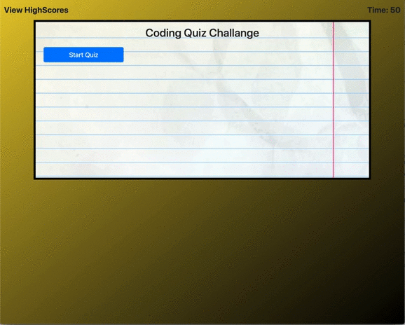

# Code-Quiz

For this I was tasked with creating a dynamically generated code quiz.

The task was a little difficult at first but once I knew what I wanted to do I was able to rinse and repeat my method.

Essentially I chose to dynamically create buttons to appear on the screen by attaching them all to on click events.

In the quiz. there are 5 questions. If you ge tthe question right your score increases by 1. If you finish the quiz with time left then the amount of time left is added to your score. If you get an answer wrong 5 seconds gets deducted from the remaining time. If you get all wrong answers your score is 0. Once the quiz is done you can add your initials or name of choice to the high score page. You can view this page at any time by clicking view high scores in the top left. Once you have submitted your score your can click the buttons to restart the quiz.

